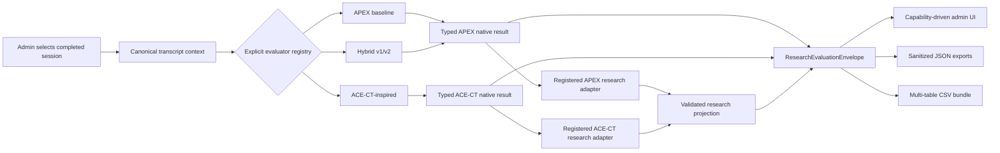
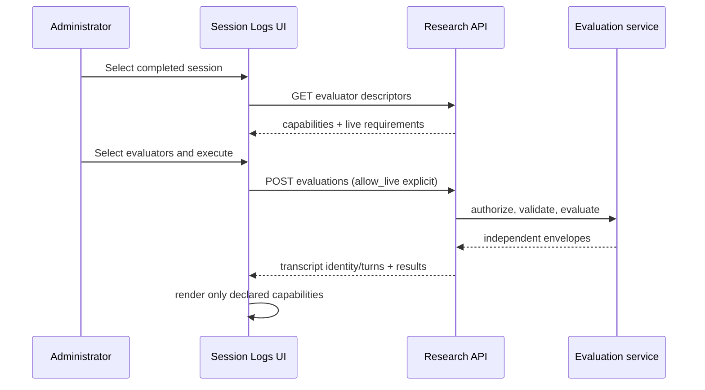

# Architecture

## Existing production workflow

The production learner path freezes patient, evaluator, and metrics plugins on
a session. On close, `ScoringService.generate_feedback` resolves the frozen
evaluator, produces `FeedbackResponse`, persists learner feedback, and runs the
frozen metrics plugins. The administrator Session Logs view reads that saved
session, transcript, feedback, and metrics timeline.

Item 1 does not modify that path.

## Research-result path

The controller applies existing admin authentication. The research evaluation
service verifies the session and completed state, creates canonical transcript
context, checks the explicit live-execution policy, invokes the existing
non-persisting evaluator computation, selects a registered adapter, validates
the envelope against the transcript, and isolates failures per evaluator.

## Component responsibilities

| Component | Responsibility |
| --- | --- |
| Research domain models | Versioned envelope, native discriminators, projection primitives, capabilities, and invariants |
| Adapter registry | Explicit deterministic evaluator-to-adapter registration; no dynamic package discovery |
| APEX adapter | Preserve `ComputedFeedback`; derive spans, labels, relations, metrics, findings, and limitations |
| ACE-CT adapter | Preserve framework and compatibility results; derive ratings, domain/compatibility metrics, findings, and modality limitations |
| Research evaluation service | Session checks, canonical transcript, live guard, execution, failure isolation, final validation |
| Research export service | Sanitization and profile-specific JSON or multi-table CSV serialization |
| Research controller | Admin-only descriptors, POST execution, and POST export boundary |
| Admin research workspace | Read-only selection, execution, capability-driven rendering, evidence navigation, provenance, and exports |

## Adaptation flows

### Baseline / SPIKES / AFCE-aligned flow

`ScoringService.compute_baseline_feedback` returns the complete in-memory
`ComputedFeedback` without persistence. The APEX native result retains scores,
opportunity/elicitation/response spans, response and elicitation links, missed
opportunities, SPIKES data, questions, findings, suggested responses, and
evaluator metadata. The adapter derives generic spans, turn labels, relations,
global metrics, and findings while the native object remains unchanged.

### Hybrid v1 and v2 flow

The existing non-persisting hybrid computation returns the same complete APEX
shape plus version-specific reviewer and merge metadata. A shared APEX adapter
is appropriate because the validated native structure is genuinely the same;
evaluator provenance remains distinct. Hybrid computation is a live-provider
capability and is refused unless both the request and server configuration
authorize it.

### ACE-CT-inspired flow

The current ACE-CT computation validates provider output before constructing
eleven dimension results, four proposed domain aggregates, assessability
counts, limitations, score-source labels, and the explicitly non-equivalent
APEX compatibility projection. The ACE adapter derives ordinal ratings,
evidence findings, domain metrics, compatibility metrics, and limitations. It
does not flatten away the authoritative framework result.

## Frontend flow

The existing transcript and saved-feedback panels remain visible. Generic
sections check capabilities and content. Framework-specific native views use
the framework-result discriminator inside the common result shell, never an
evaluator-name conditional.

## Export flow

Exports accept already validated envelopes for the selected session and verify
their transcript hash against the server-side canonical transcript. The server
removes raw transcript text by default and emits:

- complete research JSON;
- framework-native JSON;
- normalized-projection JSON;
- a ZIP bundle with `runs.csv`, `spans.csv`, `turn_labels.csv`,
  `relations.csv`, `ratings.csv`, `metrics.csv`, `findings.csv`, and
  `limitations.csv` when populated.

JSON remains authoritative; no flat CSV is described as lossless.

## Failure isolation and non-persistence

Every evaluator is an independent run. A safe failed/refused envelope retains
requested evaluator and transcript provenance but never a provider exception,
prompt, credential, or chain of thought. Successful siblings remain available.

Research execution calls computation-only methods. It does not call feedback
persistence, metrics persistence, session update, turn creation, or plugin
selection paths. No database migration is introduced.

## Future researcher-model integration

A new reviewed evaluator contributes a construct definition, evaluator wrapper,
strict native schema, deterministic research adapter, capability manifest,
explicit registration, tests, and license/privacy documentation. Approved
external services additionally require configured endpoints, authorization,
timeouts, and output limits. Item 1 provides no arbitrary upload or dynamic
production installation mechanism.
