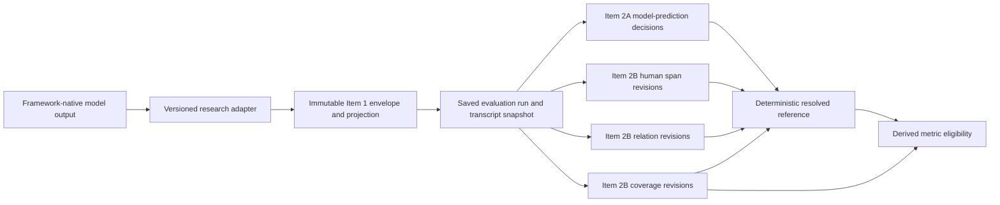
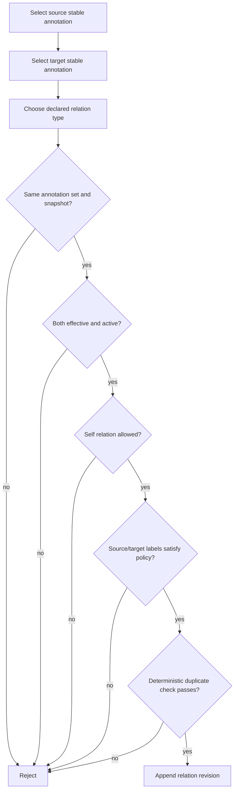
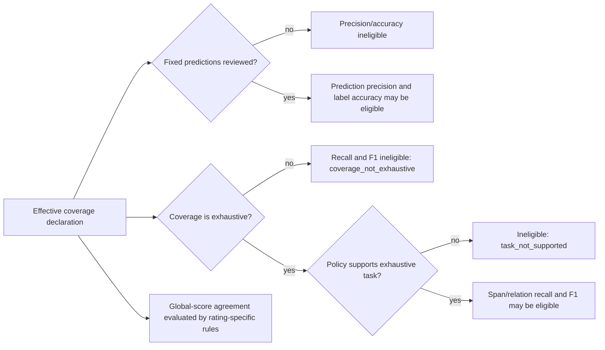

# Item 2B annotation-authoring architecture

## Scope and compatibility boundary

Item 2B extends the Item 2A saved-run workspace with contiguous single-turn
span authoring, model-span boundary correction, human-authored relations,
coverage declarations, and validation-eligibility metadata. Item 1 envelopes,
framework-native results, saved transcript snapshots, model predictions, and
Item 2A decision revisions remain immutable.

The implementation is additive:

- model-prediction review continues to use Item 2A decision revisions;
- a boundary correction is a typed Item 2A span decision that retains the
  original prediction and supplies a verified resolved range;
- human-added spans use stable identities and append-only state revisions;
- human-authored relations use stable identities and append-only state
  revisions;
- coverage declarations are append-only and identify the reviewer, policy,
  guideline, annotation-set revision, and time;
- the reference projection and metric eligibility are deterministic derived
  views, not mutable stored copies.

Item 2B does not implement discontinuous spans, multi-reviewer adjudication,
automatic model metrics, a validation dashboard, or model training.

## End-to-end data flow



The authoritative evaluator-native result remains available unchanged in full
exports. Human work is never written into that result.

## Canonical selection flow

```mermaid
sequenceDiagram
    participant R as Reviewer
    participant UI as Transcript UI
    participant O as UTF-16/code-point converter
    participant API as Research API
    participant S as Authoring service
    participant DB as Append-only research tables
    R->>UI: Select text inside one snapshot turn
    UI->>UI: Reject empty, whitespace, or cross-turn selection
    UI->>O: Convert browser UTF-16 positions
    O-->>UI: Code-point [start, end)
    UI->>R: Show composer; do not autosave
    R->>API: Save selection, label, attributes, hash, expected revision
    API->>S: Validate authorization and strict request
    S->>S: Reload immutable snapshot and verify hash, role, range, text, policy
    S->>DB: Append revision and increment set revision
    DB-->>UI: Updated set, reference view, and eligibility
```

Browser-selected text is evidence for the composer, not authority. The server
reconstructs the canonical substring from the immutable snapshot and rejects
any mismatch.

## Stable authored objects and revision streams

An authored span has a random, non-semantic stable public identity matching the
shared `span_<40 hexadecimal characters>` form. Its content is a sequence of
immutable revisions. Every revision contains a full resolved snapshot so any
historical state can be understood without mutating a predecessor.

Supported span operations are `create`, `relabel`, `edit_attributes`,
`adjust_span`, `retire`, and `restore`. The effective revision is the highest
revision number for the stable identity. Retired spans remain in audit history
and are absent from the active reference projection.

Authored relations follow the same pattern with stable
`relation_<40 hexadecimal characters>` identities and operations `create`,
`correct`, `retire`, and `restore`. Endpoint identifiers point to stable model
or human span identities, never raw offsets. Because either endpoint family
may be referenced, endpoint existence and lifecycle validity are enforced by
the service rather than by a database foreign key to one table.

All new foreign keys to the annotation set, reviewer, and superseded revision
use `RESTRICT`. Normal authoring exposes no hard-delete route. ORM mutation
guards reject updates and deletes for revision entities.

## Policy-driven authoring

The evaluator envelope remains the first capability boundary. Item 2B changes
`adjust_span`, `add_annotation`, and `add_relation` from permanently disabled
literals to boolean declarations. The versioned annotation policy further
defines:

- whether contiguous single-turn span authoring is supported;
- label, dimension, and attribute choices;
- overlap behavior;
- supported relation types and source/target label constraints;
- whether self-relations are permitted;
- which coverage declarations are meaningful;
- whether exhaustive span and relation coverage can be asserted;
- guideline help text shown by the composer.

APEX span authoring is enabled under its versioned AFCE-aligned policy. The
ACE-CT-inspired contract does not declare character-span output or authoring,
so its transcript remains read-only for span operations.

## Relation validation flow



Retiring a span does not destroy relation history. Relations with an inactive
endpoint are excluded from the active reference and cannot be restored until
their endpoints are active and valid.

## Coverage and completion

Coverage values have these meanings:

| Value | Meaning |
| --- | --- |
| `not_assessed` | No completeness claim has been recorded |
| `prediction_review_only` | Presented model predictions were assessed; missing annotations may remain |
| `exhaustive` | The complete transcript was reviewed and the reviewer attempted to add every instance permitted by the guideline |
| `fixed_inventory_complete` | Every item in a predefined inventory was reviewed; free-recall completeness is not guaranteed |

Coverage is an audited claim, not an inferred score. `prediction_review_only`,
`fixed_inventory_complete`, and `exhaustive` require all fixed model-prediction
tasks to be reviewed. `exhaustive` is accepted only when the policy says that
free-recall annotation is meaningful. Unsaved client selections never count as
coverage.

For backward compatibility, completing an Item 2A client request without a
prior coverage revision appends `fixed_inventory_complete`: the completion
action already attests that the frozen inventory was fully reviewed, but it
does not claim recall completeness.

## Coverage-to-eligibility flow



Eligibility reports metric identifiers, eligibility, reason codes,
explanations, required coverage, and current coverage. Item 2B returns no
measured precision, recall, F1, agreement, or gold-standard claim.

## Deterministic reference projection

The active reference projection contains:

- confirmed model predictions;
- corrected model predictions with human-resolved fields and correction
  provenance;
- effective active human-added spans with addition provenance;
- effective active relations whose endpoints are active and policy-valid;
- coverage, guideline, policy, contract, run, and transcript provenance.

Rejected predictions, superseded revisions, retired spans, retired relations,
and relations with inactive endpoints are excluded from the active reference
and preserved in full/audit exports. Immutable model inventory order is
preserved; authored records are queried by stable identity/revision and active
relations by stable identity, so database insertion order cannot alter the
result.

## Frontend interaction model

The existing Admin Research Workspace gains explicit `review`,
`add_annotation`, `adjust_span`, and `relation` modes. Changing or leaving a
mode clears an unsaved selection. Selection creates a pending composer only;
Save is a distinct action.

The transcript uses non-nested segmented markup for overlaps. Selecting a
segment with multiple annotations opens a disambiguation list. Detail panels
show source, resolved status, offsets, guideline, reviewer decision, history,
relations, and only policy-permitted actions. Model, corrected, human-added,
rejected, and retired states use written badges and borders/patterns in addition
to color.

Native keyboard selection is supported, followed by an **Annotate selected
text** action. Escape cancels and restores focus. Invalid selection, successful
save, conflict, retirement/restoration, and coverage changes are announced in
an `aria-live` region. The composer uses a side-panel fallback when anchored
placement would be unsafe or too narrow.

## Privacy and reproducibility

Default exports redact transcript-derived text, email-like strings, raw source
session IDs, and direct reviewer identities. Explicit privileged transcript
inclusion retains the existing warning and email-redaction policy. Offsets are
interpretable through the transcript hash, projection version, role, turn, and
declared code-point convention.

Pseudonymization does not make clinical narrative content anonymous. Export
recipients still need approved storage, access, retention, and disclosure-risk
controls.
